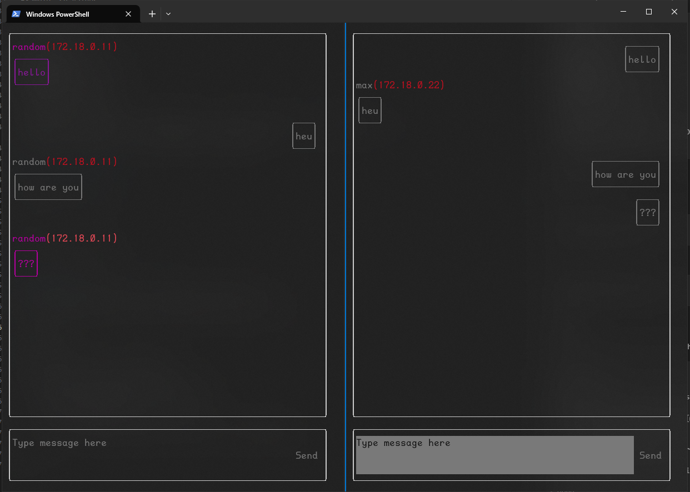

# UDP Broadcast chat APP with Adaptive Terminal UI


## About my task realisation
First, I made a simple application that strictly fulfilled the requirements of the task.
Then I decided why not decorate this console application. For this I used the FTXUI library. I haven't worked with this lib before.

The project contains a basic version, as well as an improved one (Beauty).

Beauty is launched by default; to change this, you need to comment out the section in the Dockerfile (this will speed up the build of the container)

Among other things, I optimized the docker file so that during repeated builds, all steps except the build would be loaded from the cache.
## Code detail
The code architecture is divided into 2 parts: engine, ui
The ui contains custom components.
The engine contains a controller class that connects to the socket. It has the function of listening to incoming messages with sending to the callback function, as well as the function of sending a message.

CMake builds the project depending on the Beauty environment variable if it is TRUE. Then during assembly the main class will be connected using the FTXUI library. Otherwise, no additional libraries will be included (except threads )
## Getting started
### 1. Create docker network
```
$ docker network create --subnet=172.18.0.0/24 --gateway=172.18.0.1 info
```

### 2. Build docker image 
```
$ docker build -t localchat .
```

### 3. Configure .sh/.bat values (optional)
You can change default values
Example .sh values:
```
#!/bin/bash

# Define variables
NETWORK="info"
IP_ADDRESS="172.18.0.11"
PORT="7000"
CONTAINERNAME="chatuser1"
IMAGENAME="localchat"

# Run Docker container
docker run -it --rm --name "$CONTAINERNAME" --network "$NETWORK" --ip "$IP_ADDRESS" --env IP_ADDRESS="$IP_ADDRESS" --env PORT="$PORT" "$IMAGENAME"
```

### 4. Final step. Run!
Win
```
$ .\win\run_first.bat  
```

Unix
```
$ bash unix/run_first.sh
```

### 5. Miscs.
Also in starter folders you can find stop.sh, stop.bat. 
This code forcibly turns off the container by name in the list

```
#!/bin/bash

containers=("chatuser1" "chatuser2")

for container in "${containers[@]}"; do
    docker stop "$container" > /dev/null 2>&1
    if [ $? -eq 0 ]; then
        echo "Stopped container: $container"
    else
        echo "Container $container not found or already stopped."
    fi
done
```